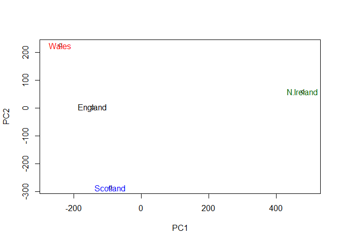

class09.Rmd
================
Christopher Cheng
2/4/2020

## K-means clustering

The main k-means function in R is called `kmeans()`. Let’s play with it
here.

Use the kmeans() function setting k to 2 and nstart=20 Inspect/print the
results

``` r
# Generate some example data for clustering
# rnorm generates two two-column datasets with x/y coordinates centered around -3 and 3 respectively. This is then combined into a matrix (4x4) and stored in tmp
tmp <- c(rnorm(30, -3), rnorm(30,3))

# setting the x coordinates as (-,+) and y coordinates as (+,-) gives us the desired plot
x <- cbind(x = tmp, y = rev(tmp))
plot (x)
```

<!-- -->

``` r
# Generate k-means clustering with example dataset
km <- kmeans(x, centers = 2, nstart = 20)
km
```

    ## K-means clustering with 2 clusters of sizes 30, 30
    ## 
    ## Cluster means:
    ##           x         y
    ## 1 -3.042653  3.325514
    ## 2  3.325514 -3.042653
    ## 
    ## Clustering vector:
    ##  [1] 1 1 1 1 1 1 1 1 1 1 1 1 1 1 1 1 1 1 1 1 1 1 1 1 1 1 1 1 1 1 2 2 2 2 2 2 2 2
    ## [39] 2 2 2 2 2 2 2 2 2 2 2 2 2 2 2 2 2 2 2 2 2 2
    ## 
    ## Within cluster sum of squares by cluster:
    ## [1] 58.45955 58.45955
    ##  (between_SS / total_SS =  91.2 %)
    ## 
    ## Available components:
    ## 
    ## [1] "cluster"      "centers"      "totss"        "withinss"     "tot.withinss"
    ## [6] "betweenss"    "size"         "iter"         "ifault"

Q. How many points are in each cluster? Answ: 30 each

Q. What ‘component’ of your result object details - cluster size? Answ:
km\(size - cluster assignment/membership? Answ: km\)cluster - cluster
center? Answ: km$centers

``` r
length(km$cluster)
```

    ## [1] 60

``` r
table(km$cluster)
```

    ## 
    ##  1  2 
    ## 30 30

Plot x colored by the kmeans cluster assignment and add cluster centers
as blue points

``` r
plot(x, col = km$cluster + 40)
points(km$centers, col = "blue", pch = 2, cex = 1.4)
```

<!-- -->

## Hierarchical clustering

The main Hierarchical clustering function in R is called `hclust()`

An important point here is you have to calculate the distance matrix
from your input data before calling `hclust()`

``` r
# First we need to calculate point (dis)similarity as the Euclidean distance between observations

dist_matrix <- dist(x)

#The hclust() function returns a hierarchical clustering model

hc <- hclust(d = dist_matrix)

# the print method is not so useful here
hc
```

    ## 
    ## Call:
    ## hclust(d = dist_matrix)
    ## 
    ## Cluster method   : complete 
    ## Distance         : euclidean 
    ## Number of objects: 60

Let’s take a closer look

``` r
dist_matrix <- dist(x)

dim(dist_matrix)
```

    ## NULL

``` r
View(as.matrix(dist_matrix))

dim(x)
```

    ## [1] 60  2

``` r
dim(as.matrix(dist_matrix))
```

    ## [1] 60 60

``` r
# Note: Symmetrical pairwise distance matrix 
```

Folks often view the results of Hierarchical clustering graphically.
Let’s try passing this to the `plot()` function.

``` r
# Create hierarchical cluster model: hc
hc <- hclust(dist(x))

# We can plot the results as a dendrogram
plot(hc)
```

<!-- -->

``` r
# What do I notice? Does the dendrogram make sense based on my knowledge of x?
```

To get a cluster membership vector I need to “cut” the tree at a certain
height to yield my sepearate cluster branches

``` r
# Draws a dendrogram
plot(hc)
abline(h = 6, col = "red", lty = 2)
abline(h = 4, col = "blue")
```

<!-- -->

``` r
gp4 <- cutree(hc, h = 4)
cutree(hc, h = 6) # Assign a cut at height = 6
```

    ##  [1] 1 1 1 1 1 1 1 1 1 1 1 1 1 1 1 1 1 1 1 1 1 1 1 1 1 1 1 1 1 1 2 2 2 2 2 2 2 2
    ## [39] 2 2 2 2 2 2 2 2 2 2 2 2 2 2 2 2 2 2 2 2 2 2

``` r
cutree(hc, k = 2) # Cut into k # of groups
```

    ##  [1] 1 1 1 1 1 1 1 1 1 1 1 1 1 1 1 1 1 1 1 1 1 1 1 1 1 1 1 1 1 1 2 2 2 2 2 2 2 2
    ## [39] 2 2 2 2 2 2 2 2 2 2 2 2 2 2 2 2 2 2 2 2 2 2

# Hierarchical clustering: My turn

``` r
# Step 1. Generate some example data for clustering

x <- rbind(
  matrix(rnorm(100, mean=0, sd = 0.3), ncol = 2),
  matrix(rnorm(100, mean = 1, sd = 0.3), ncol = 2), 
  matrix(c(rnorm(50, mean = 1, sd = 0.3), 
  rnorm(50, mean = 0, sd = 0.3)), ncol = 2))
  
colnames(x) <- c("x", "y")

# Step 2. Plot the data without clustering
plot(x)
```

<!-- -->

``` r
# Step 3. Generate colors for known clusters (just so we can compare to hclust results)
col <- as.factor( rep(c("c1","c2","c3"), each=50) )

plot(x, col=col)
```

<!-- -->

Q. Use the dist(), hclust(), plot() and cutree() functions to return 2
and 3 clusters

``` r
hc <- hclust(dist(x))
plot(hc)
abline(h = 1.65, col = "red")
```

<!-- -->

``` r
# To get cluster membership vector, we use `cutree()` and then use `table()` to tabulate up how many members in each cluster we have. 

grps <- cutree(hc, k = 3)
table(grps)
```

    ## grps
    ##  1  2  3 
    ## 47 40 63

Q. How does this compare to your known ‘col’ groups? Answ: There’s weird
overlap between groups. Program can’t decide what goes where. Use
col=grps to distinguish between these.

``` r
plot(x, col = grps)
```

<!-- -->

## Principal Component Analysis (PCA): Dimensionality reduction, visualization, and ‘structure’ analysis

# Working with UK Food

``` r
x <- read.csv("UK_foods.csv", row.names = 1)
dim(x)
```

    ## [1] 17  4

``` r
nrow(x)
```

    ## [1] 17

``` r
ncol(x)
```

    ## [1] 4

``` r
#View the components individually or in a separate tab
head(x)
```

    ##                England Wales Scotland N.Ireland
    ## Cheese             105   103      103        66
    ## Carcass_meat       245   227      242       267
    ## Other_meat         685   803      750       586
    ## Fish               147   160      122        93
    ## Fats_and_oils      193   235      184       209
    ## Sugars             156   175      147       139

``` r
tail(x)
```

    ##                   England Wales Scotland N.Ireland
    ## Fresh_fruit          1102  1137      957       674
    ## Cereals              1472  1582     1462      1494
    ## Beverages              57    73       53        47
    ## Soft_drinks          1374  1256     1572      1506
    ## Alcoholic_drinks      375   475      458       135
    ## Confectionery          54    64       62        41

``` r
View(x)
```

## Spotting major differences and trends

# Lets make some plots to explore our data a bit more

``` r
# change beside = True to get opposite orientation 

barplot(as.matrix(x), beside = F, col = rainbow(nrow(x)))
```

<!-- -->

Using pairs plot

``` r
pairs(x, col = rainbow(10), pch = 16)
```

<!-- -->

## Principal Component Analysis (PCA) with the `prcomp()` function

``` r
#Use the prcomp() PCA function

pca <- prcomp(t(x))

# looking into the components of our function output(pca). What is in my result object 'pca'?

attributes(pca)
```

    ## $names
    ## [1] "sdev"     "rotation" "center"   "scale"    "x"       
    ## 
    ## $class
    ## [1] "prcomp"

``` r
# Providing a summary of the PCA
summary(pca)
```

    ## Importance of components:
    ##                             PC1      PC2      PC3       PC4
    ## Standard deviation     324.1502 212.7478 73.87622 4.189e-14
    ## Proportion of Variance   0.6744   0.2905  0.03503 0.000e+00
    ## Cumulative Proportion    0.6744   0.9650  1.00000 1.000e+00

``` r
# Plot PC1 vs PC2
plot(pca$x[,1], pca$x[,2], xlab = "PC1", ylab = "PC2", xlim = c(-270,500))

# Adding text labels over our data points
text(pca$x[,1], pca$x[,2], colnames(x), col =c("black", "red", "blue", "darkgreen"))
```

<!-- -->

To see how much variation lies within our PCA

``` r
v <- round(pca$sdev^2/sum(pca$sdev^2) * 100)
v
```

    ## [1] 67 29  4  0

``` r
# or the second row here...
z <- summary(pca)
z$importance
```

    ##                              PC1       PC2      PC3          PC4
    ## Standard deviation     324.15019 212.74780 73.87622 4.188568e-14
    ## Proportion of Variance   0.67444   0.29052  0.03503 0.000000e+00
    ## Cumulative Proportion    0.67444   0.96497  1.00000 1.000000e+00

``` r
# This information can also be summarized graphically
barplot(v, xlab = "Principal Component", ylab= "Percent Variation")
```

<!-- -->

Digging Deeper (variable loadings)

``` r
#Just focusing on PC1 as it accounts for >90% of the variance
par(mar = c(10,3,0.35,0))
barplot(pca$rotation[,1], las = 2)
```

<!-- -->

Biplots

``` r
# The inbuilt biplot() can be useful for small datasets
biplot(pca)
```

<!-- -->

## PCA of RNA-seq data

``` r
rna.data <- read.csv("expression.csv", row.names =1)
head(rna.data)
```

    ##        wt1 wt2  wt3  wt4 wt5 ko1 ko2 ko3 ko4 ko5
    ## gene1  439 458  408  429 420  90  88  86  90  93
    ## gene2  219 200  204  210 187 427 423 434 433 426
    ## gene3 1006 989 1030 1017 973 252 237 238 226 210
    ## gene4  783 792  829  856 760 849 856 835 885 894
    ## gene5  181 249  204  244 225 277 305 272 270 279
    ## gene6  460 502  491  491 493 612 594 577 618 638

``` r
## Again we have to take the transpose of our data 
pca <- prcomp(t(rna.data), scale=TRUE)
 
## Simple un ploished plot of pc1 and pc2
plot(pca$x[,1], pca$x[,2])
```

<!-- -->

``` r
## Variance captured per PC 
pca.var <- pca$sdev^2

## Precent variance is often more informative to look at 
pca.var.per <- round(pca.var/sum(pca.var)*100, 1)
pca.var.per
```

    ##  [1] 92.6  2.3  1.1  1.1  0.8  0.7  0.6  0.4  0.4  0.0

``` r
barplot(pca.var.per, main="Scree Plot", 
        xlab="Principal Component", ylab="Percent Variation")
```

<!-- -->

``` r
## A vector of colors for wt and ko samples
colvec <- colnames(rna.data)
colvec[grep("wt", colvec)] <- "red"
colvec[grep("ko", colvec)] <- "blue"

plot(pca$x[,1], pca$x[,2], col=colvec, pch=16,
     xlab=paste0("PC1 (", pca.var.per[1], "%)"),
     ylab=paste0("PC2 (", pca.var.per[2], "%)"))

text(pca$x[,1], pca$x[,2], labels = colnames(rna.data), pos=c(rep(4,5), rep(2,5)))
```

<!-- -->

``` r
## Another way to color by sample type
## Extract the first 2 characters of the sample name
sample.type <- substr(colnames(rna.data),1,2)
sample.type
```

    ##  [1] "wt" "wt" "wt" "wt" "wt" "ko" "ko" "ko" "ko" "ko"

``` r
## now use this as a factor input to color our plot
plot(pca$x[,1], pca$x[,2], col=as.factor(sample.type), pch=16)
```

<!-- -->

``` r
loading_scores <- pca$rotation[,1]

## Find the top 10 measurements (genes) that contribute
## most to PC1 in either direction (+ or -)
gene_scores <- abs(loading_scores) 
gene_score_ranked <- sort(gene_scores, decreasing=TRUE)

## show the names of the top 10 genes
top_10_genes <- names(gene_score_ranked[1:10])
top_10_genes 
```

    ##  [1] "gene100" "gene66"  "gene45"  "gene68"  "gene98"  "gene60"  "gene21" 
    ##  [8] "gene56"  "gene10"  "gene90"

``` r
sessionInfo()
```

    ## R version 3.6.2 (2019-12-12)
    ## Platform: x86_64-w64-mingw32/x64 (64-bit)
    ## Running under: Windows 10 x64 (build 18362)
    ## 
    ## Matrix products: default
    ## 
    ## locale:
    ## [1] LC_COLLATE=English_United States.1252 
    ## [2] LC_CTYPE=English_United States.1252   
    ## [3] LC_MONETARY=English_United States.1252
    ## [4] LC_NUMERIC=C                          
    ## [5] LC_TIME=English_United States.1252    
    ## 
    ## attached base packages:
    ## [1] stats     graphics  grDevices utils     datasets  methods   base     
    ## 
    ## loaded via a namespace (and not attached):
    ##  [1] compiler_3.6.2  magrittr_1.5    tools_3.6.2     htmltools_0.4.0
    ##  [5] yaml_2.2.0      Rcpp_1.0.3      stringi_1.4.4   rmarkdown_2.1  
    ##  [9] knitr_1.27      stringr_1.4.0   xfun_0.12       digest_0.6.23  
    ## [13] rlang_0.4.4     evaluate_0.14
