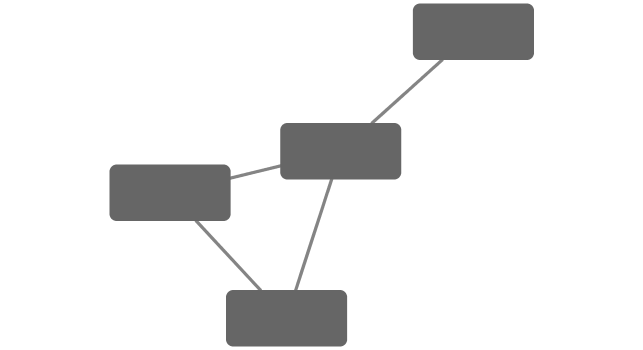
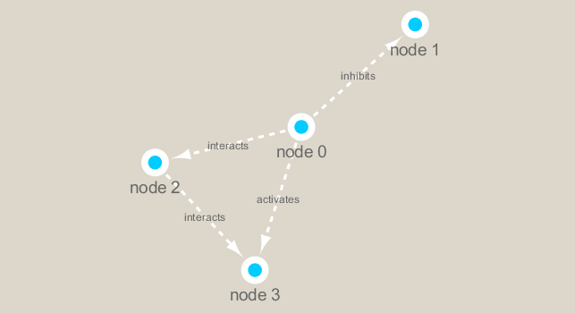

```{r setup, include=FALSE}
knitr::opts_chunk$set(echo = TRUE)
```

In this analysis we are using a Tara Ocean data and we have data from the bacterial dataset (Sunagawa et al. 2015) and also from the viral dataset (Brum et al. 2015). They have been examined in Lima-Mendez et al. (2015) and we have used the original relative abundances to visualize the data. Data were retrieved from: http://www.raeslab.org/companion/ocean-interactome.html

## Setup
First setup the packages we need.These include **igraph** from CRAN and **RCy3** from bioconductor.

I installed these with **install.packages("igraph")** and **BiocManager::install("RCy3")**. 

```{r}
# Loading Packages
library(RCy3)
library(igraph)
library(RColorBrewer)
```

```{r}
# Testing connection to Cytoscape. Note that cytoscape must be running
cytoscapePing()
```

```{r}
# Checking version
cytoscapeVersionInfo()
```


We can test things further by making a small network (here in igraph format as used by the R igraph package) and sending it to Cytoscape:

```{r}
g <- makeSimpleIgraph()
createNetworkFromIgraph(g, "myGraph")
```

We can include this Cytoscape rendered network image in our report with the following code:

```{r}
fig <- exportImage(filename = "demo", type = "png", height = 350)


```


## Switch Styles
Cytoscape provides a number of canned visual styles. The code below explores some of these styles. For example check out the marquee style!

```{r}
setVisualStyle("Marquee")
```


```{r}
fig <- exportImage(filename="demo_marquee", type="png", height=350)


```


We can also plot this simple network in R itself
```{r}
plot(g)
```

## Read our metagenomics data

We will read in a species co-occurrence matrix that was calculated using Spearman Rank coefficient. (see reference Lima-Mendez et al. (2015) for details).

```{r}
# scripts for processing located in "inst/data-raw/"
prok_vir_cor <- read.delim("./data/virus_prok_cor_abundant.tsv", stringsAsFactors = FALSE)

# Have a peek at the first 6 rows
head(prok_vir_cor)
```

Here we will use the igraph package to convert the co-occurrence dataframe into a network that we can send to Cytoscape. In this case our graph is undirected (so we will set directed = FALSE) since we do not have any information about the direction of the interactions from this type of data.

```{r}
g <- graph.data.frame(prok_vir_cor, directed = FALSE)
```

We can check the class of our new object g and see that is is of class igraph. Therefor the `print.igraph()` function will be called when we type it’s name allowing us have an informative overview of the graph structure.

```{r}
class(g)
g
```

Our current graph is a little too dense in terms of node labels etc. to have a useful ‘default’ plot figure. But we can have a look anyway.
```{r}
plot(g)
```

This is a hot-mess! Lets turn of the blue text labels
```{r}
plot(g, vertex.label = NA)
```

The nodes/vertex are too big. Lets make them smaller…
```{r}
plot(g, vertex.size = 3, vertex.label = NA)
```

To send this network to Cytoscape we can use:

```{r}
createNetworkFromIgraph(g, "myIgraph")
```


## Network Querys
```{r}
V(g)
E(g)

```

## Network Community Detection
Community structure detection algorithms try to find dense sub-graphs within larger network graphs (i.e. clusters of well connected nodes that are densely connected themselves but sparsely connected to other nodes outside the cluster) . Here we use the classic Girvan & Newman betweenness clustering method. The igraph package has lots of different community detection algorithms (i.e. different methods for finding communities).

```{r}
cb <- cluster_edge_betweenness(g)
```

```{r}
cb
```

```{r}
plot(cb, y=g, vertex.label=NA,  vertex.size=3)
```


You can extract a cluster/community membership vector for further inspection with the membership() function:
```{r}
head(membership(cb))
```


## Node degree

The degree of a node or vertex is its most basic structural property, the number of its adjacent edges. Here we calculate and plot the node degree distribution.

```{r}
# Calculate and plot node degree of our network
d <- degree(g)
hist(d, breaks=30, col="lightblue", main ="Node Degree Distribution")
```


For the `degree_distribution()` function a numeric vector of the same length as the maximum degree plus one is returned. The first element is the relative frequency zero degree vertices, the second vertices with degree one, etc.
```{r}
plot(degree_distribution(g), type = "h")
```


## Centrality analysis
Centrality gives an estimation on how important a node or edge is for the connectivity (or the information flow) of a network. It is a particularly useful parameter in signaling networks and it is often used when trying to find drug targets for example.

Centrality analysis often aims to answer the following question: Which nodes are the most important and why?

```{r}
pr <- page_rank(g)
head(pr$vector)
```


Lets plot our network with nodes size scaled via this page rank centrality scores.

```{r}
# Make a size vector btwn 2 and 20 for node plotting size

v.size <- BBmisc::normalize(pr$vector, range=c(2,20), method="range")
plot(g, vertex.size=v.size, vertex.label=NA)
```


One of the simplest centrality scores is of course degree that we calculated previously and stored as the object d. Lets plot this one out also
```{r}
v.size <- BBmisc::normalize(d, range=c(2,20), method="range")
plot(g, vertex.size=v.size, vertex.label=NA)
```


Another very common centrality score is betweenness. The vertex and edge betweenness are (roughly) defined by the number of geodesics (shortest paths) going through a vertex or an edge.
```{r}
b <- betweenness(g)
v.size <- BBmisc::normalize(b, range=c(2,20), method="range")
plot(g, vertex.size=v.size, vertex.label=NA)
```


